<div align="center">

# ⚙️ AWS DevOps Observability Engineering

### From raw telemetry to actionable signals — across **EC2, CloudWatch, Firehose, OpenSearch, Prometheus, Grafana & EKS**

<p>
  
  
  
  
  
  
</p>

<p>
  A hands-on observability implementation built as a sequence of real systems,
  real telemetry, deliberate failure tests, real notifications, and responsible teardown.
</p>

</div>

---

## 👀 Start Here

This repository is easiest to understand as a single journey:

```text
                    THE OBSERVABILITY JOURNEY

 NGINX
   │
   ├── Logs ───────────────► CloudWatch ──► Metric Filter ──► Alarm ──► SNS ──► Email
   │
   └── Access Logs ────────► Firehose ──► Lambda Transform ──► OpenSearch ──► Analytics
                                              │
                                              └──────────────► S3 (failed records)

 Infrastructure ──────────► Exporters ──► Prometheus ──► Grafana ──► Alert ──► Email

 EKS Application ──► /metrics ──► Service ──► ServiceMonitor ──► Prometheus
                                                        │
                                                        ├──► Grafana
                                                        └──► PrometheusRule ──► Alert ──► Email
```

### The project in one sentence

> **Collect what the system says, measure how it behaves, turn abnormal signals into alerts, prove those alerts under failure, and preserve enough evidence to explain the whole chain.**

---

# 🧭 What Was Built

| Layer | What was implemented | Proof |
|---|---|---|
| 📝 **Logs** | Nginx access/error logs → CloudWatch Logs | Log streams + generated traffic |
| 🚨 **Log Alerting** | Metric filters + 5xx alarm + SNS | Real `ALARM` transition + email |
| 🔄 **Streaming Analytics** | Firehose → Lambda → OpenSearch | Transformed records + indexed data |
| 📊 **Search & Dashboards** | OpenSearch Discover + visualizations | Analytics dashboard |
| 🖥️ **VM Metrics** | Prometheus + node_exporter + nginx_exporter | Targets `UP` + Grafana |
| ☸️ **Kubernetes Metrics** | EKS + kube-prometheus-stack | ServiceMonitor + PromQL |
| 🔔 **Kubernetes Alerting** | PrometheusRule + Grafana/notification flow | Firing + recovery |
| 🧹 **Cloud Hygiene** | Full post-validation teardown | Resources removed |

---

# 🏗️ Architecture

## 01 — Logs: collection → alerting

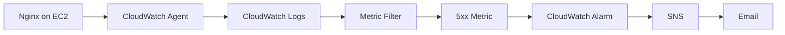

### Why this design?

The log remains the source of truth, while the metric filter converts a text pattern into something that CloudWatch can evaluate over time.

That creates a clean operational chain:

**raw event → measurable signal → threshold → notification**

---

## 02 — Logs: collection → analytics

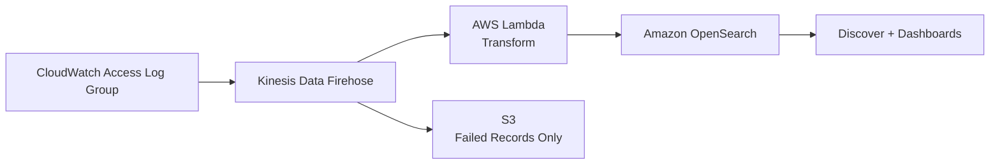

This path serves a different purpose from the alarm path.

CloudWatch answers:

> **“Is something wrong right now?”**

OpenSearch answers:

> **“What exactly has been happening, and what patterns can I investigate?”**

The assignment intentionally combines both approaches. fileciteturn28file4L307-L326

---

## 03 — EC2 metrics: scrape → visualize → alert

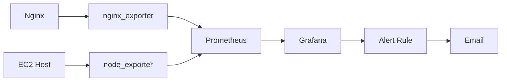

---

## 04 — EKS: application telemetry → Kubernetes observability

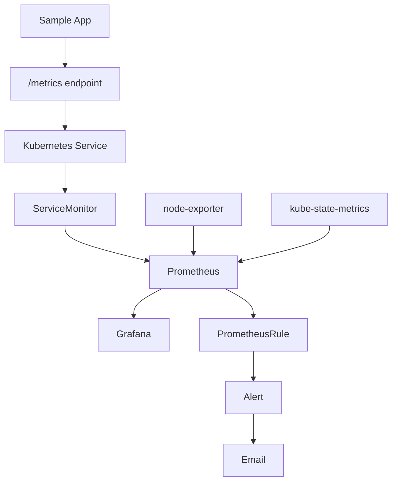

---

# 🧪 Task 1 — CloudWatch Logging & Real Alerting

### Goal

Move Nginx logs into CloudWatch, derive error metrics from the logs, and prove that an abnormal condition can trigger an operational notification.

### Implementation flow

```text
Nginx
  ↓
/var/log/nginx/access.log
/var/log/nginx/error.log
  ↓
CloudWatch Agent
  ↓
CloudWatch Log Groups
  ↓
Metric Filters
  ↓
5xx Error Metric
  ↓
Nginx-5xx-Error-Alarm
  ↓
SNS
  ↓
📩 Email
```

### What was actually validated?

| Test | Result |
|---|---|
| Nginx serving traffic | ✅ |
| Access/error logs visible in CloudWatch | ✅ |
| 200/404 traffic generated | ✅ |
| 500 errors generated intentionally | ✅ |
| Metric filter tested | ✅ |
| Alarm crossed threshold | ✅ **ALARM** |
| SNS notification received | ✅ |

### Evidence that matters

The key point is not merely that an alarm was configured. The alarm was **actually driven into `ALARM` state** and the notification was received.

<p align="center">
  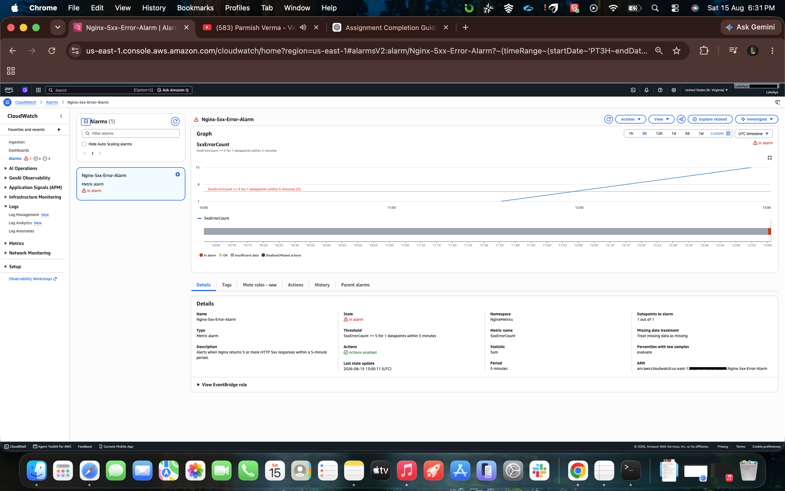
</p>

<p align="center">
  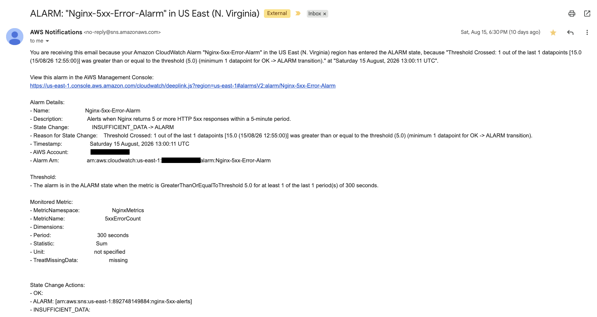
</p>

<p align="center">
  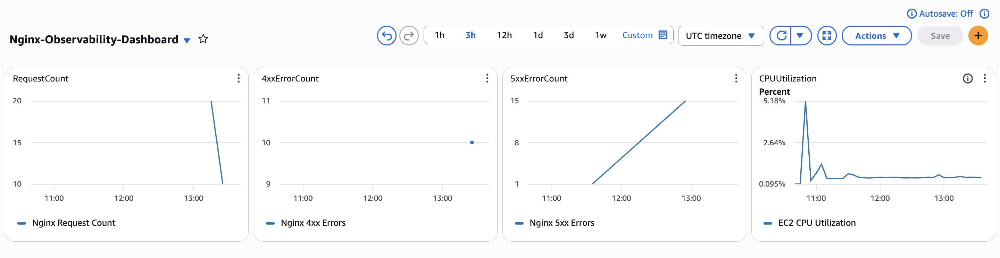
</p>

**Complete Task 1 evidence:** `docs/screenshots/task-1-cloudwatch/`

---

# 🔄 Task 2 — Firehose → Lambda → OpenSearch

### Goal

Take the same Nginx access telemetry and turn it into a searchable analytics stream.

### Pipeline

```text
CloudWatch Access Logs
        │
        ▼
Kinesis Data Firehose
        │
        ▼
Lambda Transformation
        │
        ├───────────────► S3
        │                 (failed records only)
        ▼
Amazon OpenSearch
        │
        ▼
Discover → Visualizations → Dashboard
```

### Key implementation decisions

| Component | Implementation |
|---|---|
| Source | Direct PUT |
| Transformation | `nginx-log-transform` |
| Runtime | Python 3.12 |
| Destination | Amazon OpenSearch Service |
| Index | `nginx-logs*` |
| Rotation | Daily |
| Failure path | S3, failed records only |
| Error logging | CloudWatch enabled |

The assignment specifically calls for Lambda transformation, OpenSearch delivery, daily index rotation, and a failed-record-only S3 backup. fileciteturn28file1L92-L142

### What did the transformed data look like?

Instead of treating the access log as an opaque line of text, the pipeline produced structured fields such as:

```text
remote_addr
timestamp
method
path
protocol
status
bytes_sent
referer
user_agent
```

That makes the same traffic useful for search, aggregation, and visualization.

<p align="center">
  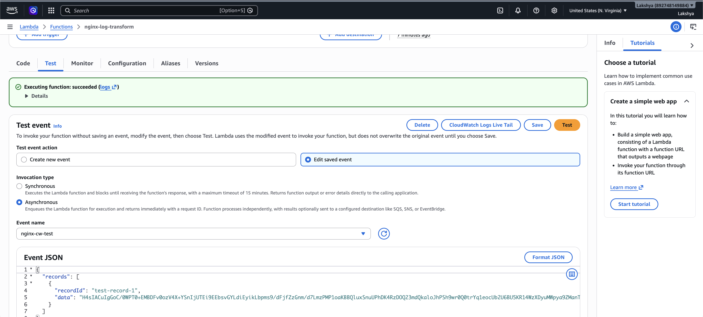
</p>

<p align="center">
  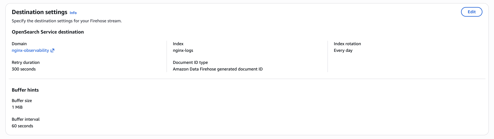
</p>

<p align="center">
  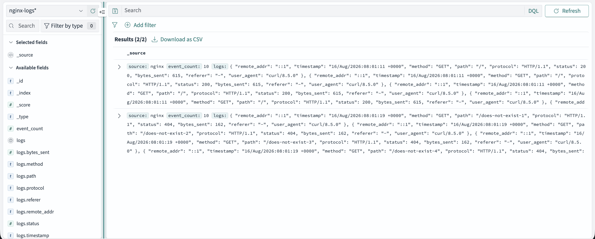
</p>

<p align="center">
  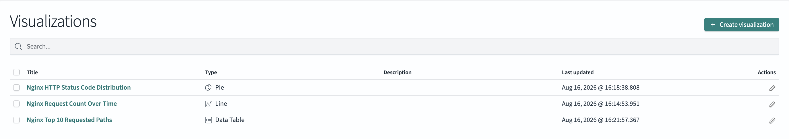
</p>

<p align="center">
  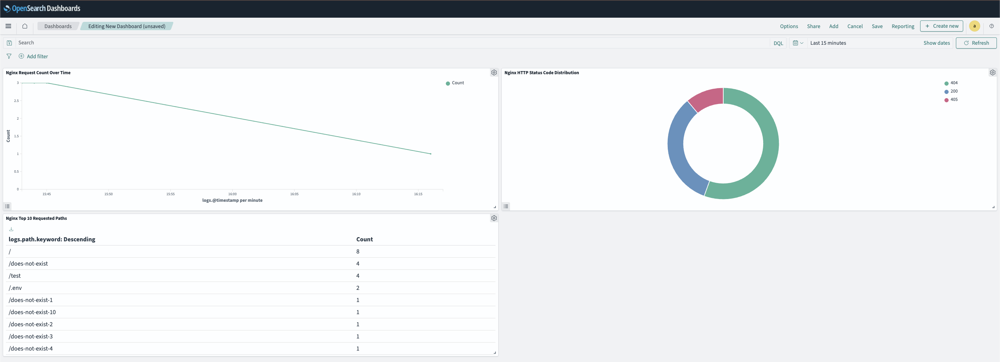
</p>

**Complete Task 2 evidence:** `docs/screenshots/task-2-firehose-opensearch/`

---

# 📈 Task 3A — Prometheus & Grafana on EC2

### Goal

Build the monitoring stack manually to understand the mechanics behind exporters, scraping, PromQL, dashboards, and alerting.

### Topology

```text
                 ┌───────────────┐
                 │ Observability │
                 │     EC2       │
                 │               │
                 │ Nginx         │
                 │ node_exporter │
                 │ nginx_exporter│
                 └───────┬───────┘
                         │ scrape
                         ▼
                 ┌───────────────┐
                 │   Prometheus  │
                 │   Monitoring  │
                 │      EC2      │
                 └───────┬───────┘
                         │
                         ▼
                    ┌─────────┐
                    │ Grafana │
                    └────┬────┘
                         │
                 Alert → Email
```

### Validation snapshot

```promql
up
```

The configured Prometheus targets returned healthy values (`1`), proving that the scrape path was working.

### Alert lifecycle

The high-CPU condition was deliberately induced rather than left untested:

```text
Normal
   ↓
Pending
   ↓
🔥 Firing
   ↓
✅ Recovered
```

Notifications were verified for both firing and recovery.

<p align="center">
  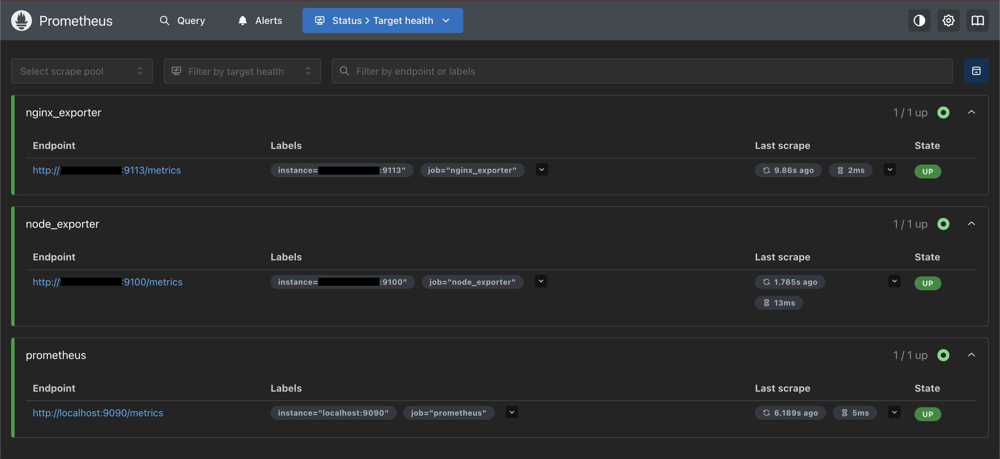
</p>

<p align="center">
  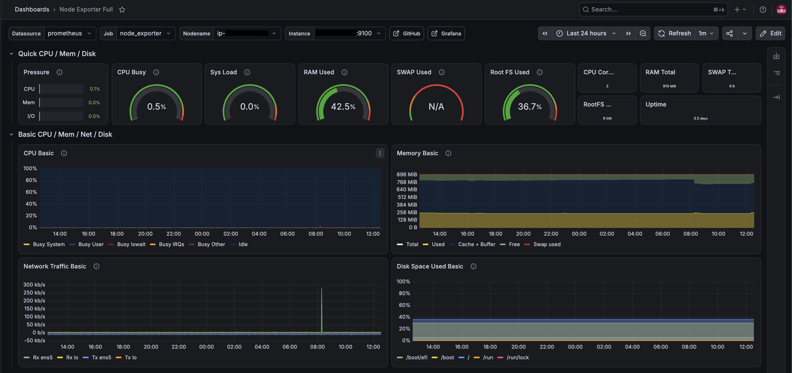
</p>

<p align="center">
  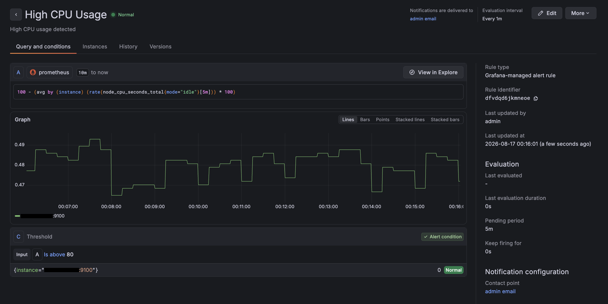
</p>

<p align="center">
  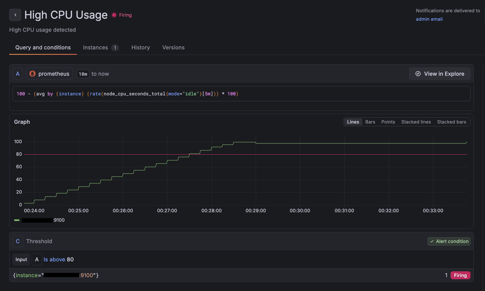
</p>

<p align="center">
  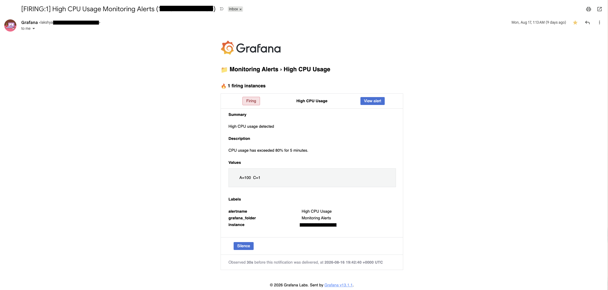
</p>

**Complete Task 3A evidence:** `docs/screenshots/task-3a-ec2-prometheus-grafana/`

---

# ☸️ Task 3B — Prometheus & Grafana on EKS

### Goal

Take the same monitoring ideas and express them natively in Kubernetes using the Prometheus Operator model.

### Stack

```text
EKS
 ├── Sample App
 │    └── /metrics
 │
 └── kube-prometheus-stack
      ├── Prometheus
      ├── Grafana
      ├── Alertmanager
      ├── node-exporter
      └── kube-state-metrics
```

### Application discovery

The sample application exposed `/metrics` through a Kubernetes Service.

A `ServiceMonitor` then described **how Prometheus should discover and scrape it**:

```yaml
interval: 15s
path: /metrics
port: metrics
```

The expected Prometheus discovery label was also applied:

```yaml
release: kube-prometheus-stack
```

The assignment specifically calls out ServiceMonitor discovery and the release-label match as an important validation point. fileciteturn28file2L187-L194

### Prometheus proof

The target:

```text
serviceMonitor/demo/sample-app/0
```

was **UP**.

Then:

```promql
up{job="sample-app"}
```

returned two healthy series with value `1`, matching the two application replicas.

### Alerting proof

A custom `PrometheusRule` named `sample-app-alerts` was created.

The rule used:

```promql
absent(up{job="sample-app"})
```

to detect disappearance of the application.

The failure test was intentionally simple:

```text
2 replicas
   ↓
Scale deployment to 0
   ↓
🚨 SampleAppDown fires
   ↓
📩 Notification received
   ↓
Restore deployment to 2
   ↓
✅ Alert resolves
   ↓
📩 Recovery received
```

<p align="center">
  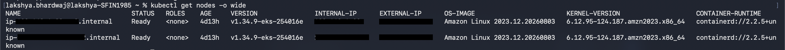
</p>

<p align="center">
  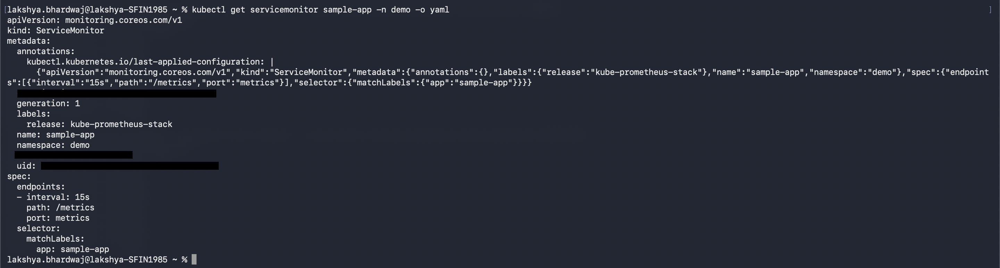
</p>

<p align="center">
  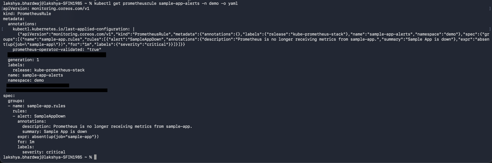
</p>

<p align="center">
  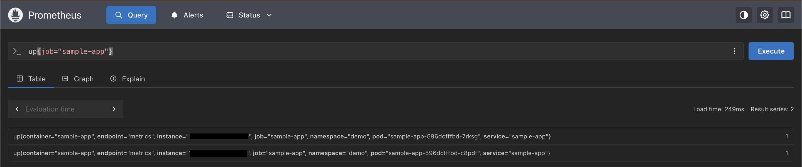
</p>

<p align="center">
  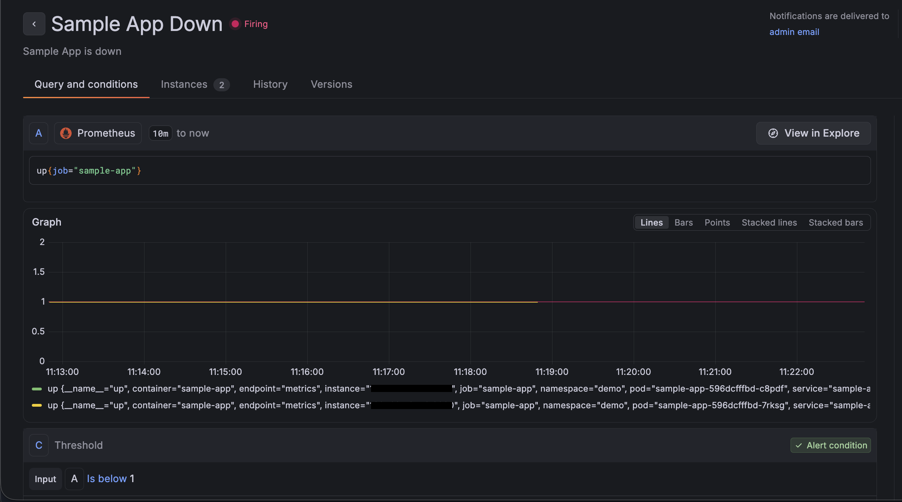
</p>

<p align="center">
  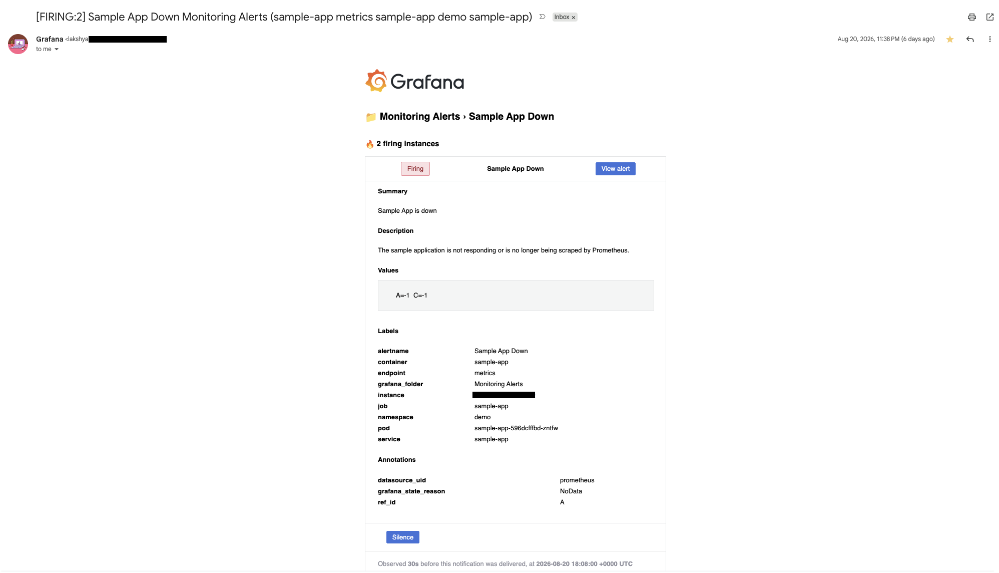
</p>

**Complete Task 3B evidence:** `docs/screenshots/task-3b-eks-prometheus-grafana/`

---

# 🧠 What Makes the Four Tasks Different?

| | Task 1 | Task 2 | Task 3A | Task 3B |
|---|---|---|---|---|
| Primary signal | Logs | Logs | Metrics | Metrics |
| Main platform | AWS managed services | AWS managed services | EC2 | Kubernetes / EKS |
| Collection model | Push | Streaming | Pull / scrape | Pull / scrape |
| Main tool | CloudWatch | Firehose + OpenSearch | Prometheus + Grafana | kube-prometheus-stack |
| Main purpose | Operational alerting | Search & analytics | Infrastructure monitoring | Kubernetes/application monitoring |
| Failure tested | 5xx errors | Delivery/transform path | High CPU | Application unavailable |
| Notification | SNS email | — | Grafana email | Alerting email |

The progression is intentional: logs first, then richer log analytics, then metrics on VMs, then metrics in Kubernetes. The assignment itself frames the three observability pillars around logs, metrics, and traces, with traces outside the required scope. fileciteturn28file4L305-L315

---

# 🔔 Alerting Philosophy

A useful distinction emerged across the project:

```text
                 TELEMETRY
                     │
        ┌────────────┴────────────┐
        │                         │
      Logs                      Metrics
        │                         │
 "What happened?"        "How is it behaving?"
        │                         │
   CloudWatch              Prometheus
        │                         │
   Metric Filter               PromQL
        │                         │
      Alarm                Grafana / Rule
        │                         │
        └────────────┬────────────┘
                     ▼
                Notification
```

The project deliberately avoided treating every event as an alert.

**Analytics needs context. Alerts need action.**

That is why Task 2 sends broad access-log data to OpenSearch while Task 1 focuses alerting on the specific 5xx condition.

---

# 🛠️ Troubleshooting That Became Part of the Learning

This was not a “click through the console and take screenshots” exercise.

### CloudWatch metric filtering
The filter needed to be tested against real Nginx log lines before trusting the alarm.

### Firehose → OpenSearch
The streaming path was validated step-by-step rather than assuming that an active delivery stream meant the data had arrived.

### Fine-grained OpenSearch access
The Firehose writer role required appropriate cluster and index permissions before the delivery pipeline could operate correctly.

### Prometheus scrape health
Exporter endpoints, network access, and Prometheus targets had to line up. Target health and the `up` query were used as direct proof.

### ServiceMonitor discovery
A valid ServiceMonitor alone was not enough; it also needed to be discoverable by the installed Prometheus Operator configuration.

### Alert testing
The strongest validation was always the failure/recovery cycle itself.

### Grafana persistence
A persistence attempt in EKS exposed the dependency on an available Kubernetes storage provisioner. The custom dashboard was recreated for final evidence; persistent dashboard storage is **not** represented as a completed feature.

---

# ✅ Final Validation Matrix

| Validation | Outcome |
|---|:---:|
| Nginx serving traffic | ✅ |
| CloudWatch log ingestion | ✅ |
| 5xx metric filter | ✅ |
| Real CloudWatch `ALARM` state | ✅ |
| SNS notification email | ✅ |
| Lambda transformation test | ✅ |
| Firehose → OpenSearch ingestion | ✅ |
| Failed-record S3 backup configured | ✅ |
| OpenSearch index pattern | ✅ |
| OpenSearch visualizations | ✅ |
| OpenSearch dashboard | ✅ |
| EC2 Prometheus targets | ✅ |
| `up` query healthy | ✅ |
| Grafana high-CPU alert | ✅ |
| EC2 alert firing + recovery emails | ✅ |
| EKS monitoring stack | ✅ |
| ServiceMonitor discovery | ✅ |
| Kubernetes `up{job="sample-app"}` | ✅ |
| PrometheusRule validation | ✅ |
| EKS alert firing + recovery | ✅ |
| Kubernetes notification emails | ✅ |
| Cloud resources torn down | ✅ |

---

# 🧹 Cost Hygiene & Teardown

The assignment explicitly treats cleanup as part of the deliverable, not an optional afterthought.

After the screenshots and functional validation were complete, the lab infrastructure was removed.

### Teardown scope

```text
Task 1
├── EC2
├── SNS
└── CloudWatch resources no longer required

Task 2
├── OpenSearch
├── Firehose
├── S3 backup
└── Lambda

Task 3A
└── EC2 monitoring infrastructure

Task 3B
├── Helm monitoring stack
├── EKS cluster
└── Worker/node infrastructure
```

The cleanup was performed only **after** the implementation and evidence had been validated, preserving the screenshots as the permanent proof of the completed lab.

Detailed record: [`teardown-log.md`](teardown-log.md)

---

# 📁 Repository Map

```text
observability-task/
│
├── README.md                         ← project story, architecture & evidence
├── teardown-log.md                   ← post-validation cleanup record
│
├── configs/
│
├── kubernetes/
│
└── docs/
    └── screenshots/
        ├── task-1-cloudwatch/
        ├── task-2-firehose-opensearch/
        ├── task-3a-ec2-prometheus-grafana/
        └── task-3b-eks-prometheus-grafana/
```

The README intentionally shows **selected evidence**, while every captured screenshot remains available in the corresponding task folder.

---

# 🎯 Engineering Takeaway

The most important lesson from the project was not memorizing individual AWS or Kubernetes services.

It was learning to think in this sequence:

```text
1. Generate telemetry
        ↓
2. Collect it reliably
        ↓
3. Turn it into useful signals
        ↓
4. Query / visualize those signals
        ↓
5. Deliberately create failure
        ↓
6. Prove the alert fires
        ↓
7. Prove notification arrives
        ↓
8. Restore the system
        ↓
9. Prove recovery
       ↓
10. Clean up the infrastructure
```

That turns **“monitoring is configured”** into **“monitoring is demonstrated.”**

---

<div align="center">

### Built as a hands-on AWS + Kubernetes observability implementation

**Logs → Metrics → Analytics → Alerts → Notifications → Recovery → Teardown**

</div>
